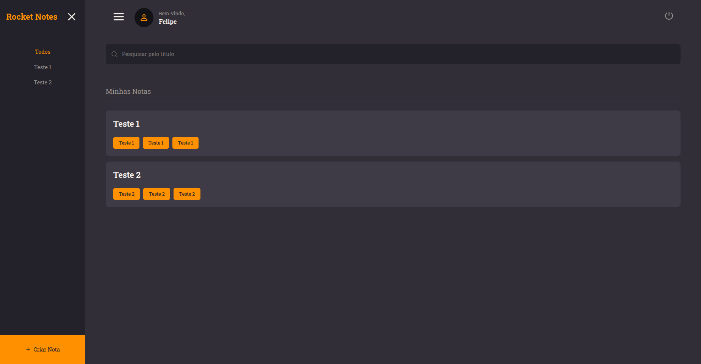

<h1 align = "center">
  
</h1>

## Sobre o projeto

O projeto Rocket Notes é uma aplicação Web desenvolvida para o usuários que desejam guardar notas importantes para suas atividades diárias em um sistema web. Na aplicação, os usuários devem se cadastrar e se autenticar para que possam criar suas notas. Assim, todas as notas ficam salvas em um banco de dados e são exibidas apenas ao usuário que a criou. Além disso, todos os usuários podem alterar as informações de seus perfis (nome, e-mail e senha), para mellhor uso da aplicação. Por fim, o sistema desenvolvido conta com telas responsivas a aparelhos mobile e desktop para melhor experiência do usuário.

## Como utilizar o projeto

### Link do deploy da aplicação

https://siterocketnotess.netlify.app/

Obs.: como a API está sendo hospedada em um provedor gratuito, após um período de inatividade ela é desligada, o que pode gerar um certo delay nas requisições. Diante disso, basta aguardar o reinício da mesma e utilizar a aplicação normalmente.
 
### Executando o Frontend do projeto

```bash

  # Vá até o diretório do projeto
  $ cd rocketnotes

  # Instale a dependência node_modules
  $ npm install

  # Inicie o servidor 
  $ npm run dev

  # Agora, basta executar cntrl + click no endereço exibido no terminal ou digitar no seu navegador de preferência:
  $ http://localhost:5173/

```

## Tecnologias utilizadas

A parte Frontend do projeto foi desenvolvida com a utilização das seguintes tecnologias:

- [ReactJS](https://react.dev/)
- [JavaScript]()
- [ReactDOM](https://www.npmjs.com/package/react-dom)
- [React Router DOM](https://www.npmjs.com/package/react-router-dom)
- [Axios](https://www.npmjs.com/package/axios)
- [React Icons](https://react-icons.github.io/react-icons/)
- [Styled Components](https://styled-components.com/)

### - ReactJS 

Biblioteca JavaScript voltada ao frontend e amplamente utilizada para o desenvolvimento de interfaces de usuário (UIs).

### - JavaScript

Linguagem de programação de tipagem fraca (não exige que o tipo de uma variável ou função seja declarado quando ela é criada) amplamente utilizada para a criação de páginas Web. Pode ser utilizada tanto no frontend (ex.: ReactJS) quanto no backend (ex.: NodeJS).

### - ReactDOM

Responsável por renderizar componentes ou elementos React na DOM.

### - React Router DOM

Biblioteca React que permite o gerenciamento de rotas entre páginas de uma aplicação Web.

### - Axios

Biblioteca React que possibilita a interação de um projeto React com APIs externas.

### - React Icons

Bibioteca React utilizada para adicionar ícones a botões no geral.

### - Styled Components

Biblioteca React que possibilita o uso do CSS-in-JS para estilização de componentes e páginas React.